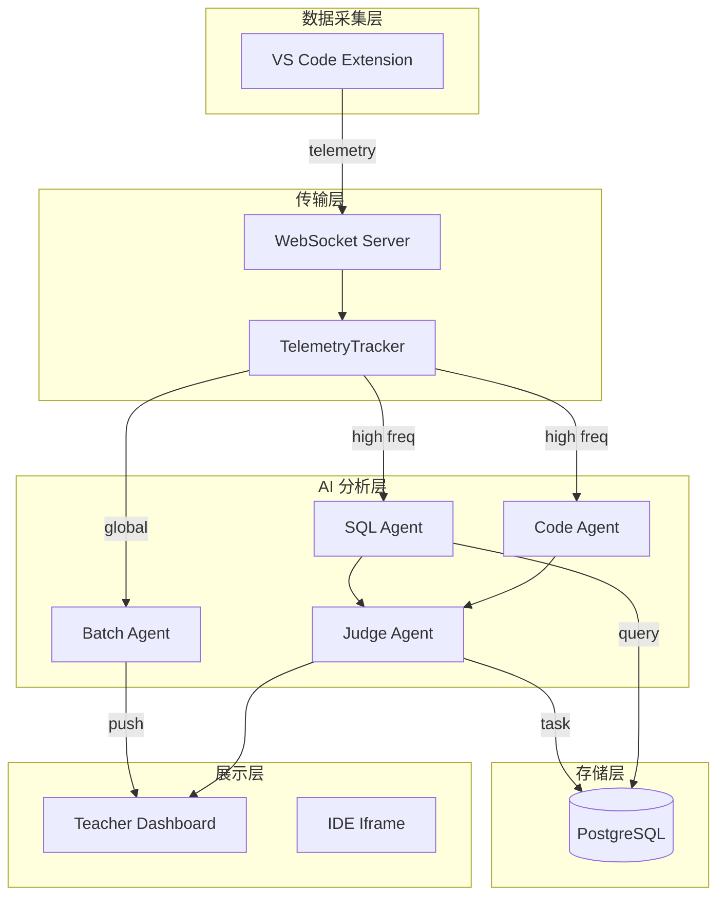
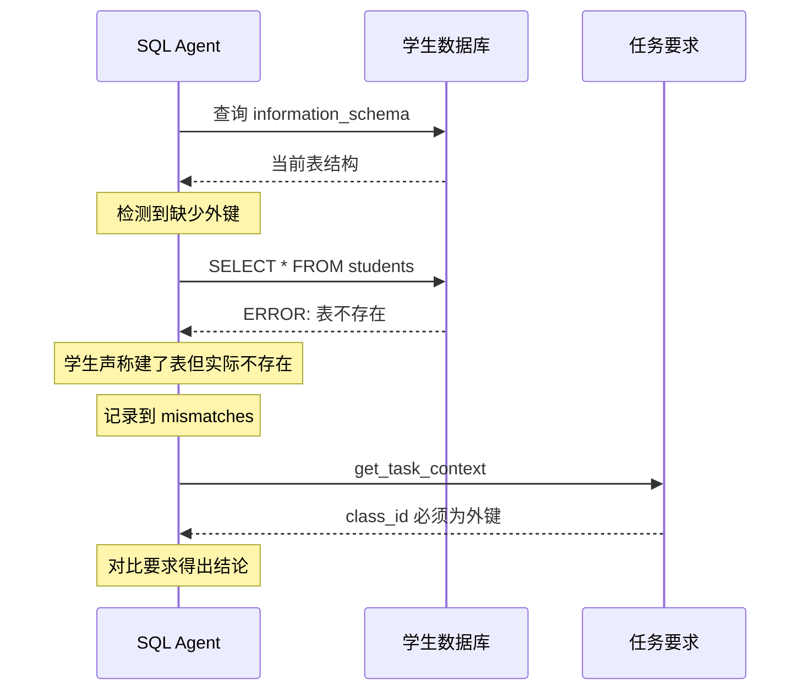
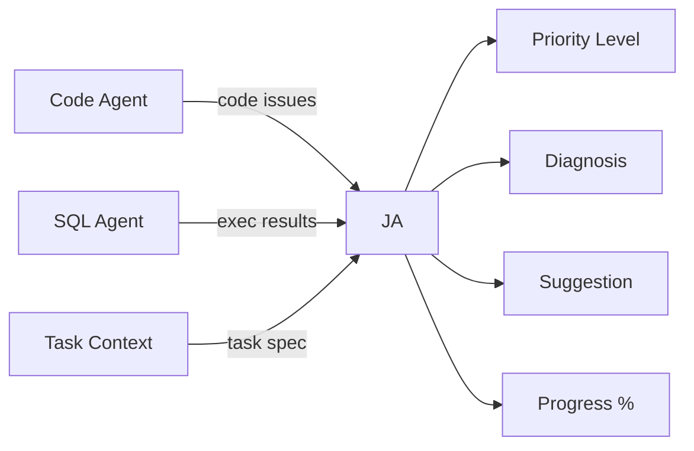
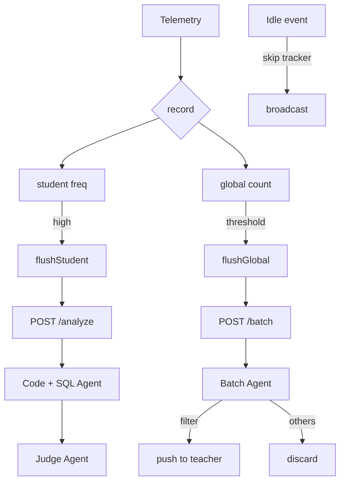

## 问题

数据库实验课的传统场景是这样的：

- 周五下午，30 名学生坐在机房里，各自对着 navicat 写 SQL
- 教师在前十分钟讲完实验要求，然后开始在过道里来回走
- 不断有人举手："老师，我这报错了"——\`ERROR: relation "students" does not exist\`
- 教师走过去看一眼："你没建表，先 CREATE TABLE"
- 回到讲台，另一边又举手了

一节课下来，老师步数刷满，依然有很多学生仍然举着手。最关键的是，老师的时间全部浪费在了找举手、走过去、催促学生切换文件、看用的是navicat还是mysql客户端上面，而不是最核心的 **解答问题** 。

SQLense 的 AI 多智能体助教架构就是来解决这个问题的。四个各司其职的 AI Agent 协同工作，为教师提供 **最高效的解答流程** 。


## 架构总览




## 四名 AI 助教

### 1. Code Agent — 编码质检员

**职责**：检查学生的 SQL 代码质量，发现语法错误、约束缺失等编码问题。

**输入**：当前代码快照 + 最近 4 段历史快照 + VS Code 诊断信息（红线错误）

**为什么需要代码历史**？只看当前快照，你可能看到一段报错代码，但不知道学生是从哪里改过来的。有了历史快照（最近 4 段），Agent 能推断出：

- 学生是先写了 SELECT 才发现表没建？
- 还是在反复修改同一个语法错误？
- 抑或是在一步步完成建表，思路是清晰的？

### 2. SQL Agent — 数据库侦探

**职责**：连接学生的独立 PostgreSQL 数据库，执行验证性查询，检查表结构是否满足要求。

**输入**：SQL 终端输出+ 学生数据库 DSN

SQL Agent 的最大亮点是**可以实际执行 SQL**。它不像一般的代码分析工具只做静态分析——它可以动态连接到学生的数据库：

1. 先通过 `asyncpg` 查询 `information_schema`，获取当前数据库的完整表结构
2. 如果发现学生声称建了表但实际没有（往往学生自己都不知道之前错误的副作用导致了什么），这就是明确的"假阳性"
3. 如果学生说"查询报错"，Agent 可以执行简化版查询，验证到底是什么问题

并且 Agent 被限制查询次数，防止滥用。



### 3. Judge Agent — 助教组长

**职责**：综合 Code Agent 和 SQL Agent 的分析结果，结合任务要求（教师上传的实验文档），给出最终的诊断、优先级和教学建议。

**输入**：
- Code Agent 的输出：代码是否有错误、问题列表、缺失的约束
- SQL Agent 的输出：执行结果、数据库表结构、预期不符项
- 任务上下文：从数据库读取教师上传的实验文档（支持 .txt 和 .pdf），提取实验要求全文

**输出**：
- **优先级**：critical / high / medium / low（规则见下方）
- **诊断描述**：学生当前遇到的问题是什么
- **修改建议**：具体如何解决
- **进度百分比**：0-100 的整数进度评估
- **建议动作**：none / notify / popup（是否立即通知教师）

优先级判定规则（LLM 遵循的准则）：
```
critical: 有语法错误未解决 + 反复失败 + 卡住无进展，需教师立即介入
high:     语法错误、表结构严重不符合要求、多次报错
medium:   接近完成但有细节问题、进度 50-80%
low:      代码基本正确、进度 80% 以上
```

**核心能力**：Judge Agent 可以读取教师上传的实验 PDF 文档，提取其中的实验要求（需要建哪些表、设哪些约束、插入多少数据），然后与学生的实际代码和数据库状态对比，给出精准评判——而不是泛泛的"代码有误"。



### 4. Batch Agent — 课堂巡视员

**职责**：当遥测数据积累到 100 条时，一次性扫描全班学生，筛选出"当前需要关注"的学生。

**输入**：全班学生的遥测摘要（每人最近 15 条事件）

**输出**：需要关注的 student_id 列表 + 整体筛选理由

**筛选逻辑**（全部由 LLM 判断，无硬编码规则）：
- 需要关注：代码有语法错误、终端 SQL 报错、反复出错超过 3 次、代码偏离任务要求
- 无需关注：只有空闲事件、正常编辑无报错、SQL 执行成功


## 调度机制：双路缓冲

WebSocket Server 中的 `TelemetryTracker` 实现了一个双路调度策略：



- **高频通路**：某个学生在 10 秒内产生 ≥2 条非空闲遥测 → 触发 `/analyze` → 三个 AI Agent 流水线分析 → 结果推送给教师
- **批量通路**：全局累计 ≥100 条遥测 → 触发 `/batch` → Batch Agent 筛选 -> 推送需要关注的学生名单
- **空闲事件**：跳过 tracker，直接向教师端广播 `teacher:telemetry`，不触发任何 AI 分析


## 日志粒度：从 VS Code 到 AI 诊断的完整链路

AI 分析的质量取决于采集的数据有多细。SQLense 的遥测系统从三个维度采集学生行为，覆盖**代码、执行、状态**全链路。

### 3 种采集事件

| 事件类型 | 采集方式 | 携带内容 | 用途 |
|---------|---------|---------|------|
| `error` (diagnostics) | VS Code 诊断视图持续错误 ≥2 次/5s | 当前代码快照 + 最近 4 段历史 + 错误列表 | 触发 Code Agent 分析 |
| `error` (sqltools) | SQLTools 终端执行报错 | SQL 语句 + 错误消息 | 触发 SQL Agent 分析 |
| `idle` | 180s 无键盘/鼠标活动 | 空闲持续时间 | 统计专注度，不进 AI 分析 |

除此之外，`code_history` **每 30 秒**自动采样编辑器的 SQL 代码内容，但它不直接上报——而是附着在下一次的 `error` 事件中（最近 4 段快照），让 AI 看到代码的**演变过程**，而不是孤立的报错截图。


## 为什么是四智能体而不是一个大模型？

| 特性 | 单智能体 | 四智能体分工 |
|------|---------|-------------|
| **关注点分离** | 一个 prompt 里塞满所有要求 | 每个 Agent 只关注一件事，prompt 简短精确 |
| **工具权限隔离** | 需要判断"安全的"查询 | SQL Agent 有执行权限，Code Agent 不需要 |
| **成本优化** | 每次都用大模型分析全部 | Code Agent 可能返回无错误 → Judge Agent 跳过复杂推理 |
| **并行执行** | 串行等待所有分析 | Code + SQL 可以并发执行 |
| **可观测性** | 一个输出，看不出哪里错了 | 哪个 Agent 出问题一目了然 |

## 优势总结

**1. 教师时间解放**

从"过道里来回走"到"实时 AI 诊断推送"，一个教师的能力上限从关注当前学生提升到覆盖全班 30 人。CRITICAL 级别的学生得到优先关注，LOW 级别的学生教师闲暇之余也能监控与监管。教师只做最需要人的事。

**2. 精细化诊断**

不是笼统的"错这了"，而是精确到"第几行语法错误"+"缺少哪个外键"+"建议修改方案"。Code Agent 看到的历史快照还能推断学生的错误模式——是粗心还是概念没理解。通通反馈到教师端，无需教师花费时间通读上下文。

**3. 双路调度兼顾实时与全面**

高频通路保证活跃学生秒级响应，批量通路确保不会遗漏"安静出错"的学生。一台 2C4G 服务器就能覆盖一个 30 人班级的全部 AI 分析负载。

**4. 架构可扩展**

Agent 之间通过 Pydantic 模型解耦，增加一个新的 Agent（比如 Grading Agent）只需要定义新模型的 Agent 类，插入到现有流水线中即可。任何支持 OpenAI 兼容 API 的模型都可以替换——DeepSeek、混元、GPT，随时切换。维护成本低，全部日志可追溯。
